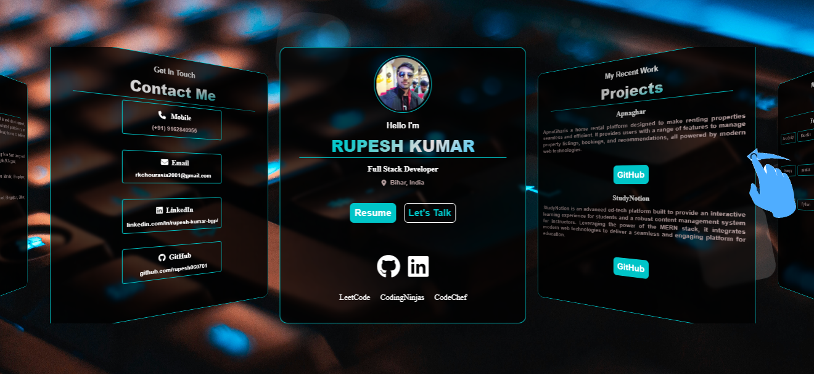

# Portfolio Website  [live website](https://www.example.com)

This is a personal portfolio website built using HTML, CSS, and JavaScript. It showcases my skills, projects, and contact information in a visually appealing and user-friendly manner.

## Features

- 🎨 **Responsive Design**: Fully responsive layout optimized for desktop, tablet, and mobile devices.
- 👤 **About Me**: A section highlighting my background, skills, and interests.
- 💻 **Projects**: Display of my key projects with links to GitHub repositories.
- ✉️ **Contact Information**: Users can send messages directly via a different contact method like email, mobile etc.
- 🧭 **Smooth Navigation**: Intuitive and smooth scrolling between sections.
- 🎥 **Animations**: Subtle animations for an engaging user experience.

## Technologies Used

- 🌐 **HTML5**: For structuring the content.
- 🎨 **CSS3**: For styling and layout design.
- ⚡ **JavaScript**: For interactive and dynamic elements.
